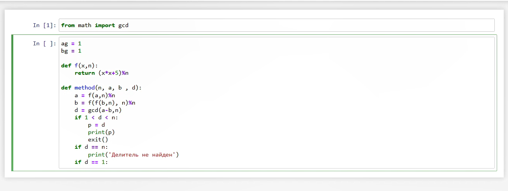
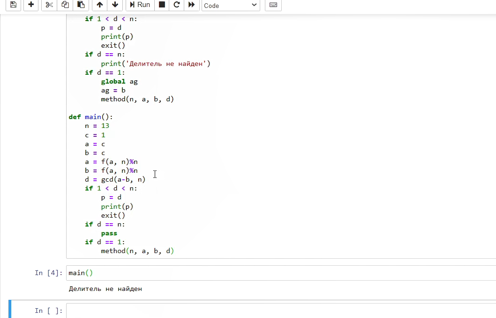
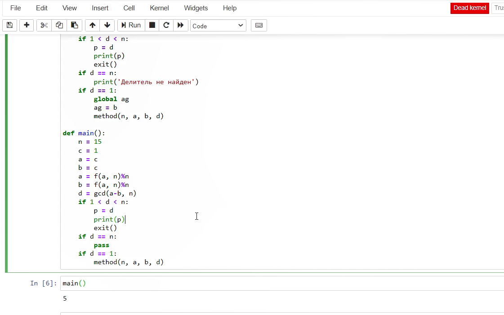

---
## Front matter
lang: ru-RU
title: Отчёт по лабораторной работе 6
author: 'Кочетов Андрей Владимирович'
date: 23 ноября, 2022

## Formatting
toc: false
slide_level: 2
theme: metropolis
mainfont: PT Serif
romanfont: PT Serif
sansfont: PT Sans
monofont: PT Mono
header-includes: 
 - \metroset{progressbar=frametitle,sectionpage=progressbar,numbering=fraction}
 - '\makeatletter'
 - '\beamer@ignorenonframefalse'
 - '\makeatother'
aspectratio: 43
section-titles: true
---

## Цель работы

Реализовать алгоритм.

## Задание

Лабораторная работа подразумевает написание программы на языке python, которая проверяет наличие делителя у заданного числа.

# Выполнение лабораторной работы

1. Начинаю реализовывать код

   { #fig:001 width=60% }

---

2. Закончил код, проверил работоспособность.

   { #fig:002 width=60% }

---

3. Задал иное число и проверил работоспособность.

   { #fig:003 width=60% }

---

# Выводы

Я написал программный код, который реализует определение делителя.

## {.standout}

Спасибо за внимание!
